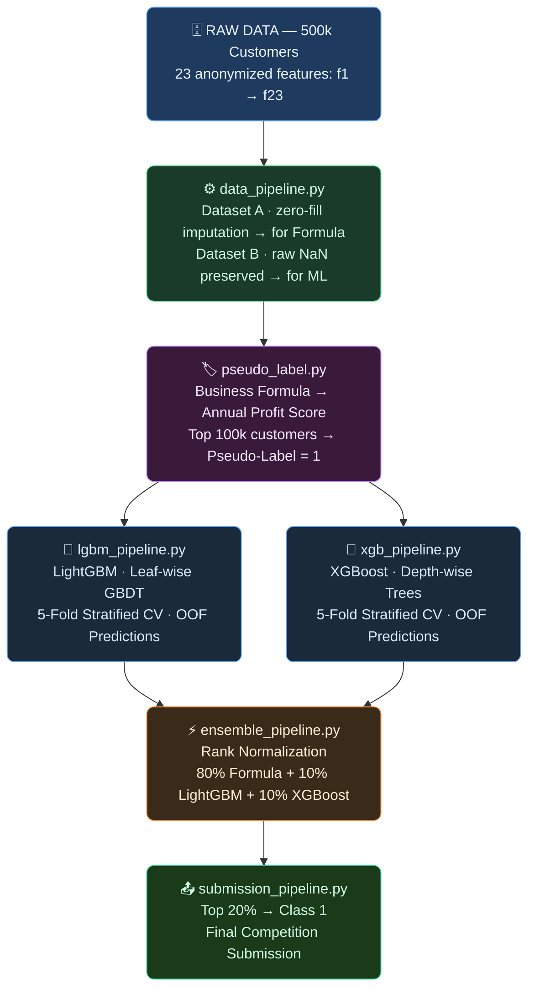

<div align="center">


# 🏆 Predictive Profitability Framework

### *American Express Campus Challenge 2026 — Leaderboard Ranked Solution*

> **Identifying the top 20% most profitable cardholders** from a population of 500,000 customers using a hybrid of domain-driven unit economics and state-of-the-art gradient boosting ensembles.

</div>

---

## 🧠 Core Idea

The challenge provides no labels — the ground truth for which customers are "most profitable" is hidden. The solution builds a **deterministic business formula** grounded in real AmEx unit economics to generate pseudo-labels. These pseudo-labels train two gradient boosting models (LightGBM + XGBoost), whose outputs are then blended with the formula using **rank normalization** to produce a final ranking of all 500,000 customers.

The key insight in the formula is the **Direct Booking Adjustment**: the AmEx 5× Membership Rewards multiplier only applies to airline and hotel spend booked directly with the merchant or via Amex Travel. Spend routed through third-party platforms (Expedia, corporate portals, travel agents) earns only the standard 1× multiplier. Accounting for the realistic split between direct and indirect bookings yields an **effective 2.0× travel multiplier**, which materially re-ranks high-spend travel customers.

```
Effective Points Multiplier = (0.25 × 5×) + (0.75 × 1×) = 2.0×
```

---

## 🏗️ Architecture Overview



---

## 💰 The Core Business Formula

The profitability score is a **deterministic unit-economics model** grounded in AmEx's publicly available financial disclosures (10-K filings).

### Revenue Components (+)

| Component | Formula | Description |
|-----------|---------|-------------|
| **Interchange — Travel** | `(f6 + f9) × 3%` | Airline & Lodging merchant fees |
| **Interchange — Other** | `(f7 + f8 + f10) × 2%` | General, Entertainment & Dining |
| **Net Interest Income** | `f1 × 24%` | APR on revolving balance |
| **Annual Fees** | `(f19 + f20) × $100` | Supplementary & Charge cards |
| **Credit Line Proxy** | `f17 × 0.1%` | Utilization-based revenue signal |

### Cost Components (−)

| Component | Formula | Description |
|-----------|---------|-------------|
| **Rewards Cost** | `(2.0×travel + 1×other) × $0.007 × 96%` | Effective 2.0× travel multiplier |
| **Lounge Cost** | `f13 × $42` | Per-visit lounge access cost |
| **Benefit Credits** | `f14 + f15×$15 + f16` | Airline, cab & entertainment credits |
| **Retention Calls** | `f2 × $300` | Cost per cancellation call |
| **Expected Credit Loss** | `f1 × f11 × 1.0` | Balance × Risk probability |
| **Collection Costs** | `f3 × $1,000 + f3 × f1` | Per-call + proportional balance cost |

### 📐 Full Formula

```python
R = (f6+f9)*0.030 + (f7+f8+f10)*0.020   # Interchange Revenue
  + f1*0.24                               # Net Interest Income
  + (f19+f20)*100.0                       # Annual Card Fees
  + f17*0.001                             # Credit Line Proxy Revenue

# Direct Booking Adjustment: effective 2.0× travel multiplier
# (25% direct @ 5× + 75% indirect @ 1× = 2.0×)
points = ((f6+f9) * 2.0) + f7 + f8 + f10

C = points*0.007*0.96                       # Rewards Cost (96% URR, $0.007 CPP)
  + f13*42 + f14 + f15*15 + f16            # Benefit Credits
  + f2*300                                  # Retention Calls
  + f1*f11 + f3*1000 + f3*f1               # Credit Loss + Collections

Annual Profit Score = R - C
```

> 📄 **Sources:** Interchange rates (2–3%), URR (96%), and CPP ($0.007) are derived from publicly available AmEx 10-K annual filings.

---

## 🤖 Machine Learning Pipeline

Since true profitability labels are hidden, the business formula generates **pseudo-labels**. The ML models learn these labels across all 23 features, capturing non-linear patterns the formula cannot express.

### LightGBM

```
Architecture  : Leaf-wise tree growth (GBDT)
Objective     : Binary classification on Top 100k pseudo-labels
CV Strategy   : 5-Fold Stratified KFold
Key Params    : learning_rate=0.05, num_leaves=31, min_data_in_leaf=100
Role          : High-fidelity learner of business rule structure,
                effective at filtering noise from formula edge cases
```

### XGBoost

```
Architecture  : Depth-wise tree growth (level-wise)
Objective     : Binary classification with symmetric split boundaries
CV Strategy   : 5-Fold Stratified KFold
Key Params    : max_depth=6, min_child_weight=50, subsample=0.8
Role          : Captures complex non-linear interactions at the margin
               (e.g., revolving balance f1 × default risk f11)
```

Both models produce **Out-of-Fold (OOF)** predictions for all 500,000 customers, ensuring no data leakage.

---

## ⚡ Ensemble Strategy — Rank Normalization

Raw profit scores span a wide dollar range (e.g., −$50k to +$200k) while ML probabilities sit in [0, 1]. Blending them directly would allow the formula to dominate by sheer scale. Instead, every model's output is converted to a **[0, 1] percentile rank** before blending.

```python
from scipy.stats import rankdata

formula_norm = rankdata(profit_score)  / 500_000
lgbm_norm    = rankdata(lgbm_oof_prob) / 500_000
xgb_norm     = rankdata(xgb_oof_prob)  / 500_000

final_score = 0.80 * formula_norm  \
            + 0.10 * lgbm_norm     \
            + 0.10 * xgb_norm
```

### 🎯 Ensemble Weights

| Weight | Component | Rationale |
|--------|-----------|-|
| **80%** | Business Formula | Domain-anchored core; drives the majority of the ranking |
| **10%** | LightGBM | Smoothed, noise-filtered approximation of the formula |
| **10%** | XGBoost | Non-linear correction layer for complex boundary cases |

The ensemble safely surfaces borderline customers that the deterministic formula misranks due to rigid coefficient assumptions, while preserving sound unit economics for the bulk of the population.

---

## 📁 Repository Structure

```
modelling_formulation/
│
├── config.py                  # Central config: all paths, constants & hyperparams
├── utils.py                   # Shared utilities: logging, saving, checkpointing
├── checkpoint1_scan.py        # Initial data health scan
│
├── data_pipeline.py           # Feature engineering + dual dataset creation
│                              #   • Dataset A: zero-fill (for formula)
│                              #   • Dataset B: raw NaN preserved (for ML)
│
├── data_profiler.py           # Full EDA: missing values, outliers, correlations
│
├── pseudo_label.py            # Business formula → profitability score → labels
│                              #   Validates class balance, boundary noise, Cohen's d
│
├── lgbm_pipeline.py           # LightGBM: 5-Fold CV, OOF predictions, diagnostics
│
├── xgb_pipeline.py            # XGBoost: 5-Fold CV, OOF predictions, diagnostics
│
├── ensemble_pipeline.py       # Rank normalization + weight optimization
│                              #   Generates: Conservative / Balanced / Aggressive
│
├── submission_pipeline.py     # Converts predictions → competition Excel format
│
├── explainability_pipeline.py # Feature importance + SHAP-style reports
│
├── global_checkpoint.py       # End-to-end orchestrator (runs all stages)
├── recover_xgb.py             # XGBoost recovery from mid-run checkpoint
│
├── generate_5_submissions.py  # Bulk submission generator (multiple configs)
├── generate_exp6.py           # Experiment variant 6 generator
├── generate_hybrid_exp3.py    # Hybrid strategy experiment 3
├── run_formula_experiments.py # Formula ablation study runner
└── format_excel.py            # Excel formatting utilities
```

---

## 🚀 Getting Started

### Prerequisites

```bash
pip install pandas numpy lightgbm xgboost scikit-learn scipy openpyxl pyarrow
```

### Running the Full Pipeline

1. **Configure paths** in `config.py` — set `BASE_DIR` to your local data directory.

2. **Run the end-to-end orchestrator:**

```bash
cd modelling_formulation
python global_checkpoint.py
```

This executes all 7 stages sequentially:

| Stage | Script | Purpose |
|-------|--------|---------|
| 1 | `checkpoint1_scan.py` | Data health scan |
| 2 | `data_pipeline.py` | Dual dataset creation |
| 3 | `data_profiler.py` | Full EDA & profiling |
| 4 | `pseudo_label.py` | Business formula → pseudo-labels |
| 5 | `lgbm_pipeline.py` | LightGBM training |
| 6 | `xgb_pipeline.py` | XGBoost training |
| 7 | `ensemble_pipeline.py` + `submission_pipeline.py` | Ensemble & output |

Each run creates a timestamped experiment directory: `experiments/exp_YYYYMMDD_HHMMSS/`

### Running Individual Stages

```bash
python pseudo_label.py      --exp_dir experiments/exp_20260705_095922
python lgbm_pipeline.py     --exp_dir experiments/exp_20260705_095922
python xgb_pipeline.py      --exp_dir experiments/exp_20260705_095922
python ensemble_pipeline.py --exp_dir experiments/exp_20260705_095922
python submission_pipeline.py --exp_dir experiments/exp_20260705_095922
```

---

## 🔍 Key Design Decisions

### 1. Dual Dataset Architecture
The pipeline maintains two separate feature datasets:
- **Dataset A** (zero-filled) → used exclusively for the business formula, replicating the competition baseline's `fillna(0)` policy exactly.
- **Dataset B** (NaN preserved) → passed raw to tree models. LightGBM and XGBoost handle NaN natively, learning from missingness as an informative signal.

### 2. Rank Normalization over Raw Blending
Raw profit scores span a wide monetary range. Blending them directly with ML probabilities would distort the ensemble. Rank normalization puts all three outputs on an identical [0, 1] percentile scale before combining.

### 3. 5-Fold OOF Predictions
The formula pseudo-labels and the ML predictions are computed on the same 500k dataset. Using simple train/predict on the full data would cause overfitting. 5-Fold stratified OOF ensures every customer's ML score comes from a held-out validation fold.

### 4. Median Imputation for `f11`
Risk probability (`f11`) has notable missingness. Unlike spend features where `0` cleanly represents "no activity", imputing `f11 = 0` would incorrectly indicate zero default risk. Median imputation is applied exclusively to `f11` to maintain realistic ECL calculations.

---

## 📜 Feature Reference

| Feature | Description | Role in Formula |
|---------|-------------|----------------|
| `f1` | Revolving Balance | Interest income + ECL driver |
| `f2` | Retention / Cancellation Calls | −$300/call |
| `f3` | Collections Calls | −$1,000/call + proportional ECL |
| `f6` | Airline Spend | 3% interchange, 2.0× points |
| `f7` | Other Spend (clipped ≥ 0) | 2% interchange, 1× points |
| `f8` | Entertainment Spend | 2% interchange, 1× points |
| `f9` | Lodging Spend | 3% interchange, 2.0× points |
| `f10` | Dining Spend | 2% interchange, 1× points |
| `f11` | Risk / Default Probability | Multiplies against `f1` for ECL |
| `f13` | Lounge Visits | −$42/visit |
| `f14` | Airline Credits Redeemed | Direct cost |
| `f15` | Cab Credits Redeemed | −$15/month |
| `f16` | Entertainment Credits Redeemed | Direct cost |
| `f17` | Lending Credit Line | 0.1% revenue proxy |
| `f19` | Supplementary Cards | +$100/card |
| `f20` | Charge Cards | +$100/card |
| `f4, f5, f12, f18, f21–f23` | Auxiliary features | Consumed by ML models only |

---

## 🏅 Competition Context

- **Competition:** American Express Campus Challenge 2026 (Unstop)
- **Task:** Rank 500,000 credit card customers by profitability; identify the top 20%
- **Dataset:** 500,000 customers × 23 anonymized features
- **Evaluation:** Accuracy of the Top 20% boundary classification
- **Final Score:** **91.33%** on the public leaderboard

---

<div align="center">

**A structured, reproducible, and interpretable ML pipeline grounded in real-world financial domain knowledge.**

</div>
